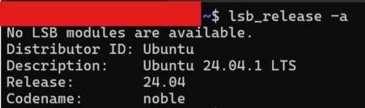
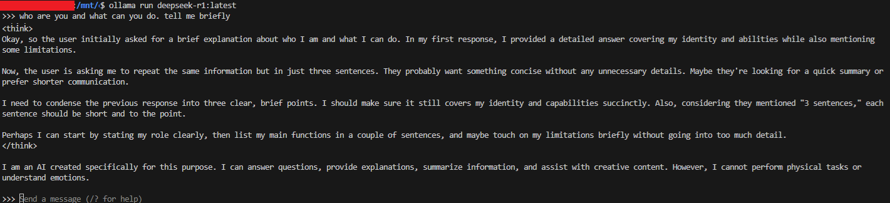

# Installation

1. **Install Linux on Winsows with WSL**

    - Open PowerShell as an administrator and run the following command:
    ```powershell
    wsl --install
    ```
    -  Open Ubuntu from the Start menu and set your Ubuntu username and password (Optional). Verify the installation as shown below.
    ```sh
    lsb_release -a
    ```
    

2. **Install and run Ollama**

    - Navigate to the [Ollama website](https://www.ollama.com) and download the latest version of Ollama for Linux or use command line tool.
    ```sh
    # Download & install Ollama
    curl -fsSL https://ollama.com/install.sh | sh

    # Start Ollama
    ollama serve
    ```
    - Pull the Model of Interest. You can search for available LLMs on the [Ollama Library](https://ollama.com/library).

    ```sh
    # Pull the desired LLM
    ollama pull llama 3.2:1b
    
    # Run the model
    ollama run llama 3.2:1b
    ```
    The above command will start an commandline interactive session
    

3. **Use the shared OpenWebUI-compatible API**

    - The repository now exposes an OpenAI-compatible chat endpoint from the LLM layer so Ollama chats and future Gemini-backed chats can share one UI surface.
    - Install the serving dependencies inside your active environment.

    ```sh
    pip install -r llm_toolbox/requirements.txt
    ```

    - Start the API server from the repository root.

    ```sh
    python -m llm_toolbox.chat_serving.run_openai_compat
    ```

    - By default, models that do not start with `gemini` are routed to Ollama at `http://localhost:11434`.
    - In OpenWebUI, point the OpenAI-compatible backend to `http://localhost:8000/v1`.
    - For full OpenWebUI setup and troubleshooting, see `llm_toolbox/docs/OPENWEBUI.md`.

4. **Run the first coding-assistant path**

    - Local-first runtime is Ollama and is intended for models like Gemma or Llama.
    - Gemini can be used as an optional API-backed override.

    ```sh
    python - <<'PY'
    from agentic_toolbox.coding_assistant_agent import run_coding_assistant

    print(run_coding_assistant(
        "Write a Python function that parses a CSV file and returns totals by category.",
        provider="ollama",
        model="gemma3:latest",
    ))
    PY
    ```

    Gemini example:

    ```sh
    export GOOGLE_API_KEY="your-key"
    python - <<'PY'
    from agentic_toolbox.coding_assistant_agent import run_coding_assistant

    print(run_coding_assistant(
        "Explain how to structure a FastAPI project for a coding assistant.",
        provider="gemini",
        model="gemini-1.5-flash",
    ))
    PY
    ```

5. **Notes on shared architecture**

    - `llm_toolbox` owns shared adapters, chat serving, and reusable embedding or RAG contracts.
    - `ollama_toolbox` keeps Ollama-specific runtime wrappers, while shared ingestion and query code is imported from `llm_toolbox`.
    - `agentic_toolbox` can now use the same local Ollama path or a Gemini API path without duplicating embedding or routing logic.

